## 🗺️ Visual Map Showcase (Results)

### 1. World Favorites
*Identifies the highest Letterboxd-rated feature film (60–220 min) released in each nation's catalog. Countries that share the exact same top film share the exact same color.*
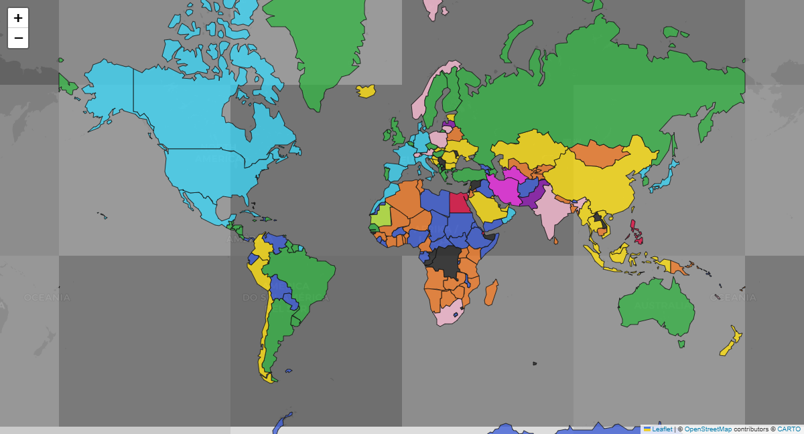

---

### 2. Film Domestic vs. Foreign Origin
*Cross-references distribution countries with production origins. Green indicates a domestic or co-produced top film; Red indicates a foreign import.*
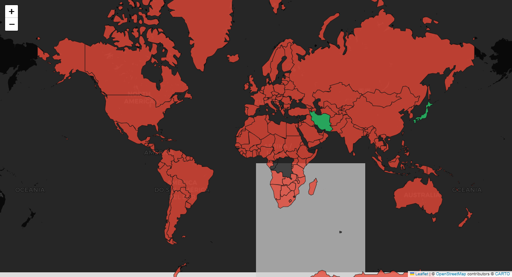

---

### 3. Country Spotlight & Global Reach
*Ranks a nation's top 10 films and directors (min. 3 films). Calculates shared catalog overlap across 0 to 20,000+ shared titles using a logarithmic scale:*

$$\text{Shared Movies} = |M_A \cap M_B|$$

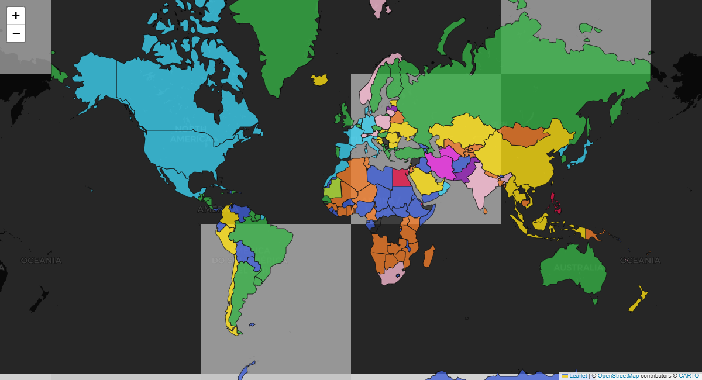

---

### 4. Genre Capitals of the World
*Evaluates the mode (most frequent) genre entry across all feature films in each country's catalog.*
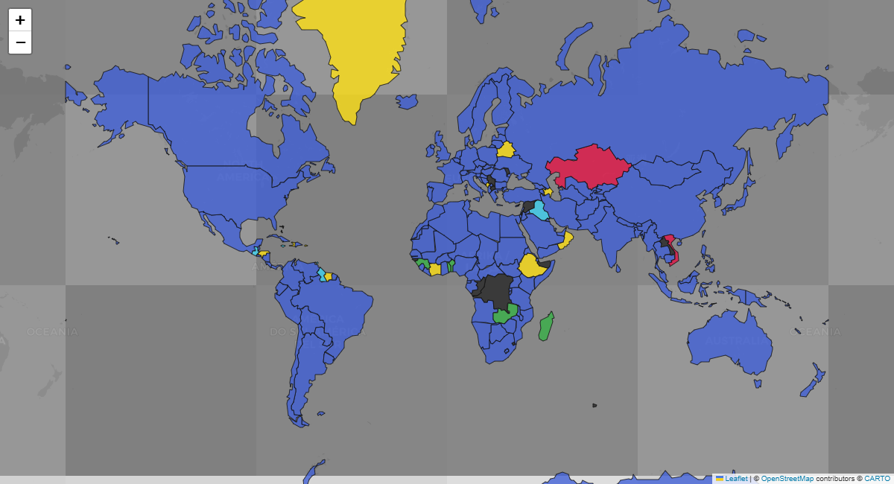

---

### 5. Hollywood Dependence Index
*Measures the proportion of US-produced films in each country's catalog:*

$$\text{Hollywood Share} = \left( \frac{\text{USA Movies in Catalog}}{\text{Total Catalog Movies}} \right) \times 100\%$$

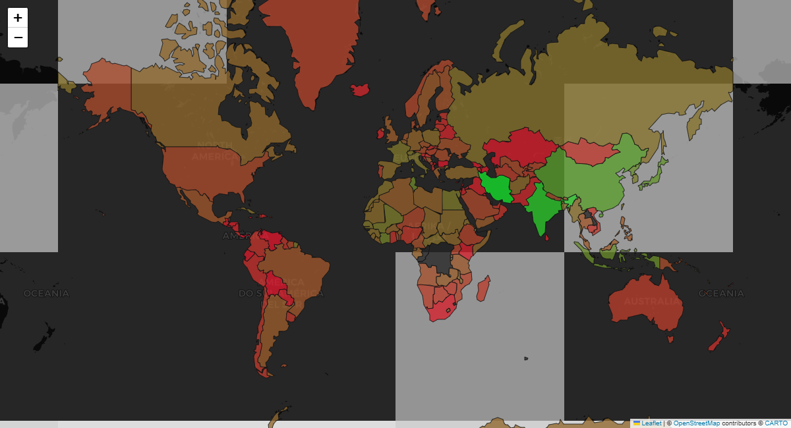

---

### 6. The Nostalgia Index (Vintage vs. Modern Taste)
*Computes the average release year ($\bar{Y}$) of the top 20 highest-rated films in a nation's catalog. Purple = Pre-1985 (Classic Era); Yellow = Post-2005 (Modern Era).*
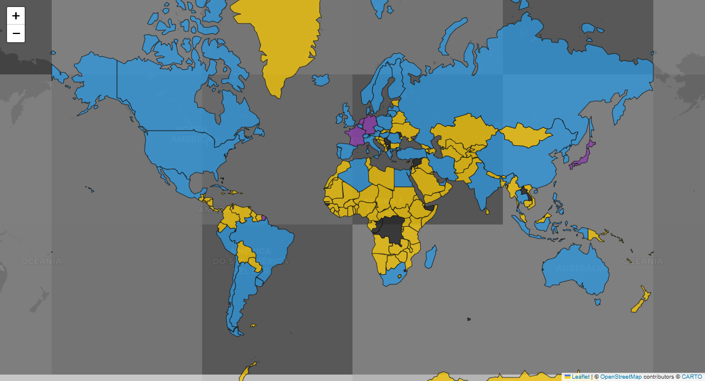

---

### 7. The Sin City & Crime Index
*Ranks countries by crime, action, thriller, and mystery focus:*

$$\text{Crime Share} = \left( \frac{\text{Crime + Action + Thriller + Mystery Entries}}{\text{Total Genre Entries}} \right) \times 100\%$$

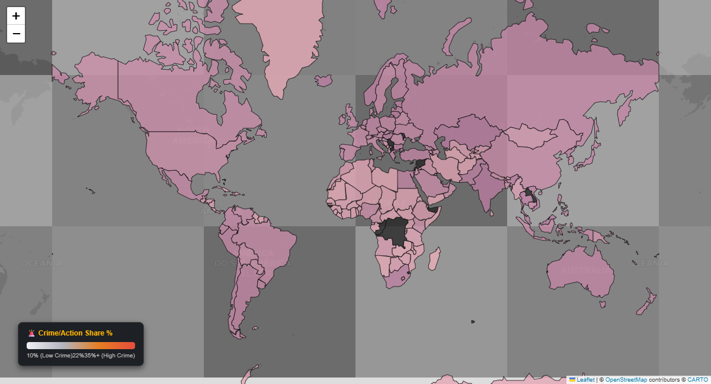

---

### 8. The Darkness Index
*Compares dark genres against lighthearted genres:*

$$\text{Dark Ratio} = \left( \frac{\text{Horror + Thriller + Crime + Mystery}}{\text{Dark Genres + Light Genres}} \right) \times 100\%$$

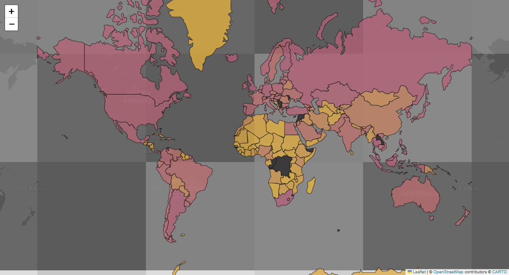

---

### 9. Cinematic Taste Twin Finder
*Calculates Cosine Similarity between normalized genre distribution vectors to locate every country's closest cinema taste twin:*

$$\text{Similarity}(V_A, V_B) = \frac{V_A \cdot V_B}{\|V_A\| \cdot \|V_B\|}$$

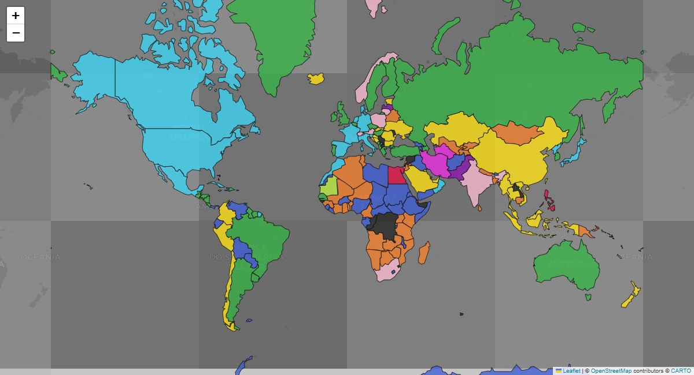

---

### 10. The Slow Cinema / Patience Index
*Measures average feature film runtime ($\bar{R}$) in minutes. Calibrated from 90m (Ice Blue) to 130m+ (Deep Violet).*
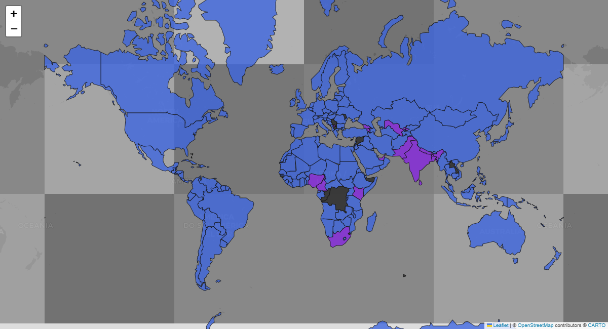

---

### 11. Futurism & Cyberpunk Index
*Measures the share of Science Fiction in national catalogs:*

$$\text{Sci-Fi Share} = \left( \frac{\text{Science Fiction Entries}}{\text{Total Genre Entries}} \right) \times 100\%$$

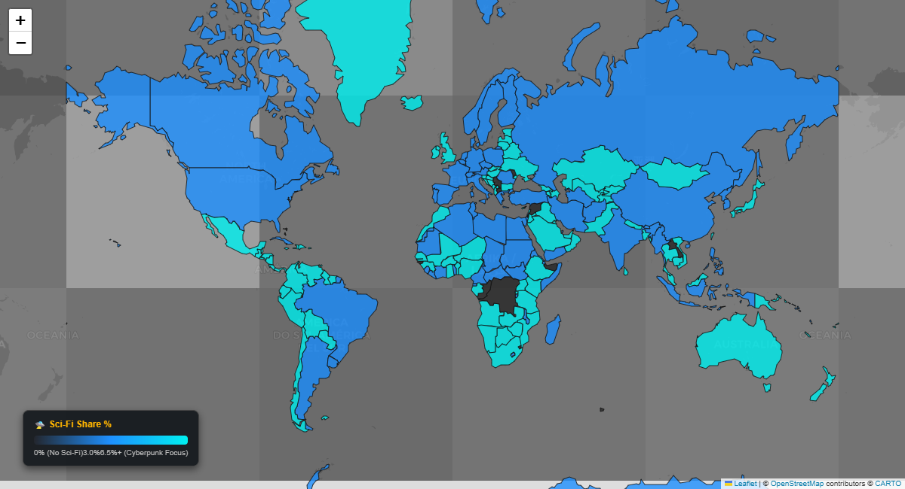

---

### 12. The Tears & Melodrama Index
*Calculates emotional melodrama focus:*

$$\text{Melodrama Share} = \left( \frac{\text{Romance + Drama Entries}}{\text{Total Genre Entries}} \right) \times 100\%$$

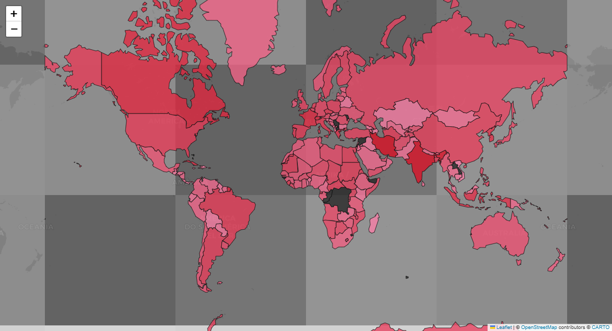